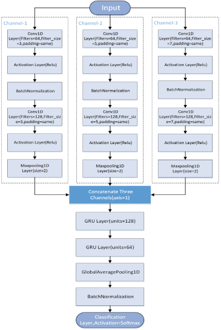
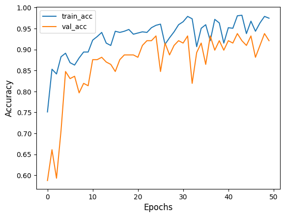
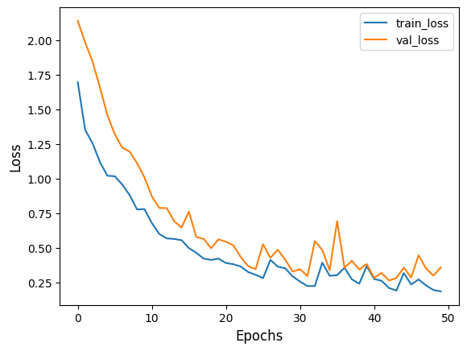

# 🛡️ User Authentication Using Motion Data

This repository presents a **machine learning-based solution** for user authentication using motion and touch gesture data from the **HMOG dataset**. By leveraging unique patterns in motion data, the system demonstrates the feasibility of accurate and reliable user identification.

The project includes comprehensive utilities for **data preprocessing**, **feature engineering**, and **model training**, supported by visualizations for better interpretability.

---

## 📑 Table of Contents
1. [📖 Overview](#overview)
2. [📂 Dataset](#dataset)
3. [⚙️ Features](#features)
   - [🛠️ Python Utilities](#python-utilities)
   - [📓 Model Training Pipeline](#model-training-pipeline)
4. [📊 Results](#results)
5. [📈 Visualizations](#visualizations)
6. [🚀 How to Use](#how-to-use)
7. [🔮 Future Work](#future-work)

---

## 📖 Overview

Motion and touch data are inherently individualistic, making them a valuable resource for user authentication. This project focuses on developing a robust pipeline to preprocess, analyze, and model motion and touch data, ensuring reliable user identification.

The **HMOG dataset** serves as the backbone of this project, featuring detailed motion sensor readings and touch gesture logs. The machine learning pipeline incorporates advanced techniques to handle data imbalance, generate features, and build models tailored for authentication tasks.

---

## 📂 Dataset

The **HMOG dataset** provides rich motion and gesture data collected via mobile device sensors, including:
- **📡 Motion Data**: Accelerometer, gyroscope, and magnetometer readings.
- **👆 Touch Gesture Data**: Logs of user interaction with the touchscreen (e.g., swipe gestures).

### Key Details:
- **Data Composition**: Includes recordings from multiple users across different sessions.
- **Subset Selection**: For this project, data from **3 users with 13 sessions each** was used.
- **Preprocessing**: Data standardization, balancing, and slicing were implemented to ensure high-quality inputs for the model.

> 📥 Access the dataset here: [HMOG Dataset](https://hmog-dataset.github.io/hmog/)

---

## ⚙️ Features

### 🛠️ Python Utilities

The repository offers a suite of utilities for efficient data processing:

1. **`overSampling()`**  
   - ⚖️ Balances motion and touch gesture data using oversampling techniques.  
   - Addresses size disparities between different data types.  

2. **`ETLHelper()`**  
   - 🧹 Supports the ETL pipeline for **Extracting**, **Transforming**, and **Loading** data.  
   - Streamlines preprocessing steps for motion and gesture data.  

3. **`ETL()`**  
   - Implements the complete ETL workflow:  
     - **📥 Extract**: Reads raw sensor and gesture data.  
     - **🔄 Transform**: Standardizes, cleans, and formats the data.  
     - **📤 Load**: Prepares datasets for model training and evaluation.  

4. **`dataGenerator()`**  
   - ♻️ Efficiently generates batches for machine learning models.  
   - Handles large datasets through slicing and batching.  

5. **`slice()`**  
   - ✂️ Splits motion data into overlapping slices for detailed analysis.  
   - Extracts features from smaller, more granular windows.  

---

### 📓 Model Training Pipeline

The project features a **Jupyter Notebook** designed to:
- 📊 Split the preprocessed data into **training**, **validation**, and **testing** sets.  
- 🧠 Train **multi-channel models** to extract features from motion and gesture data.  
- ✅ Evaluate performance based on metrics such as **accuracy**, **precision**, and **loss**.

---

## 📊 Results

The machine learning pipeline achieved:
- **🎯 92% test accuracy**: Demonstrating the effectiveness of motion and gesture data for user authentication.  

### Key Observations:
- **Data Slicing**: Smaller, overlapping slices of motion data improved feature extraction and model performance.  
- **Balancing**: Addressing data imbalance led to consistent accuracy across different classes.  

---

## 📈 Visualizations

### 🏗️ Model Architecture
The model utilizes a multi-channel architecture for parallel processing of motion and touch data. The layers are optimized for feature extraction and classification.

  
*Figure: Multi-channel model for user authentication.*

---

### 📉 Training Metrics

#### Accuracy and Loss Curves
Training and validation metrics highlight the model's learning progress:

- **📈 Accuracy Over Epochs**:  
    
  _Figure: Training vs. validation accuracy._

- **📉 Loss Over Epochs**:  
    
  _Figure: Training vs. validation loss._

#### Additional Visuals
- **📊 Confusion Matrix**: Illustrates classification accuracy across users.  
- **💡 Feature Importance**: Highlights key contributors to authentication decisions (e.g., accelerometer vs. gyroscope data).  

---

## 🚀 How to Use

1. **Clone the Repository**:
   ```bash
   git clone https://github.com/Achrefdjaber/User-Authentication-Using-Motion-Sensor-Data.git
   cd User-Authentication-Using-Motion-Sensor-Data
